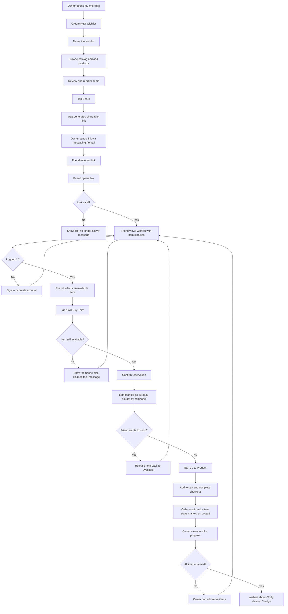

# Customer Journey To-Be: Wishlist Sharing & Gift Coordination

## Overview

This journey maps the experience of an e-commerce user sharing a wishlist with friends and coordinating gift purchases so that items are not bought more than once. Two personas are involved: the **Wishlist Owner** (who creates and shares) and the **Gift Buyer** (a friend who receives the shared link and buys items).

---

## Phase 1: Create and Curate a Wishlist

**Happy path:**
1. User navigates to "My Wishlists" from their account menu
2. User taps "Create New Wishlist" and enters a name (e.g., "Birthday 2026")
3. User browses the product catalog and taps "Add to Wishlist" on desired products, selecting the target wishlist
4. User reviews the wishlist, reorders items by priority if desired, and sees the final list ready to share

**Exceptions:**
- **Duplicate product added:** App shows a brief notice that the item is already on the wishlist and does not add it again
- **Wishlist name already exists:** App appends a number (e.g., "Birthday 2026 (2)") and lets the user rename it

---

## Phase 2: Generate and Send a Sharing Link

**Happy path:**
1. User opens the wishlist and taps "Share"
2. App generates a unique shareable link with a read-only token
3. User copies the link or selects a share target (messaging app, email, social media) via the OS share sheet
4. Friend receives the link in their messaging app or email

**Exceptions:**
- **User wants to revoke access later:** User taps "Manage Link" in the wishlist settings and disables the existing link; anyone with the old link sees a "This wishlist is no longer shared" message
- **User wants to regenerate the link:** User taps "Reset Link" which invalidates the old link and creates a new one

**Touchpoints:** Web app, mobile app, email, messaging apps

---

## Phase 3: View Shared Wishlist as a Friend

**Happy path:**
1. Friend taps the shared link and the wishlist opens in the app (or in a mobile-friendly web view if the app is not installed)
2. Friend sees the wishlist name, owner's display name, and the list of products with images, names, and prices
3. Each item shows its availability status: "Available to buy" or "Already bought by someone"
4. Friend browses the list to decide which gift to purchase

**Exceptions:**
- **Link is invalid or revoked:** App shows a clear message: "This wishlist link is no longer active" with no further action required
- **Product is out of stock:** Item displays an "Out of Stock" badge; friend can still see it but cannot mark it as bought
- **Friend is not logged in:** Friend can view the wishlist without logging in, but must sign in or create an account before marking an item as bought

**Touchpoints:** Web app, mobile app

---

## Phase 4: Mark an Item as "Bought"

**Happy path:**
1. Friend selects an available item and taps "I'll Buy This"
2. App asks for confirmation: "Mark this as bought? The wishlist owner won't see who is buying it."
3. Friend confirms, and the item status changes to "Already bought by someone" for all other friends viewing the wishlist
4. App briefly shows a confirmation: "Got it — this item is reserved for you"

**Exceptions:**
- **Two friends tap "I'll Buy This" at nearly the same time (race condition):** The first confirmation wins; the second friend sees a message: "Someone else just claimed this item" and is returned to the list
- **Friend changes their mind before purchasing:** Friend taps "Undo" on the confirmation screen (available for 30 seconds) or finds the item in "My Reserved Gifts" and taps "Release Item," which returns it to "Available to buy"

---

## Phase 5: Purchase the Gift

**Happy path:**
1. Friend taps "Go to Product" on the reserved item, which opens the product detail page in the e-commerce store
2. Friend adds the product to their shopping cart and completes checkout through the standard e-commerce purchase flow
3. After order confirmation, the item remains marked as "Already bought by someone" on the shared wishlist

**Exceptions:**
- **Friend decides to buy the gift elsewhere:** The item stays marked as bought because the friend already claimed it; no integration with external stores is needed
- **Friend's order is cancelled or refunded:** Friend manually releases the item from "My Reserved Gifts," returning it to "Available to buy" for others

---

## Phase 6: Wishlist Owner Reviews Progress

**Happy path:**
1. Wishlist owner opens their shared wishlist and sees a progress indicator (e.g., "4 of 7 items bought")
2. Owner sees which items are marked as "Already bought by someone" — but does NOT see who bought them, preserving the gift surprise
3. Owner can add more items to the wishlist at any time; new items immediately appear for friends with the link

**Exceptions:**
- **Owner wants to remove an item that has already been claimed:** App warns: "Someone has already reserved this item as a gift. Remove anyway?" If confirmed, the buyer sees a notification that the item was removed from the wishlist
- **All items are bought:** Wishlist shows a "Fully claimed!" badge and the owner sees a message: "All items have been reserved by your friends"

**Touchpoints:** Web app, mobile app, push notification (if an item the buyer reserved is removed)

---

## Journey Diagram

