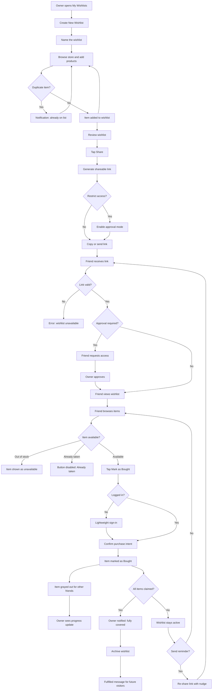

# Customer Journey To-Be: Wishlist Sharing & Gift Coordination

## Overview

This journey maps the experience of an e-commerce user sharing a wishlist with friends and coordinating gift purchases so that recipients get what they want without duplicate gifts. Two personas interact: the **Wishlist Owner** (who creates and shares the list) and the **Friend** (who receives the shared link, browses items, and marks purchases).

---

## Phase 1: Create and Curate a Wishlist

**Happy path:**
1. User navigates to "My Wishlists" from their account menu
2. User taps "Create New Wishlist" and enters a name (e.g., "Birthday 2026")
3. User browses the store and adds products to the wishlist via an "Add to Wishlist" button on each product page
4. User selects which wishlist to add the product to when they have multiple wishlists
5. User reviews the wishlist page, which shows all added items with photos, names, and prices

**Exceptions:**
- **User has no account:** App prompts sign-up or login before creating a wishlist, then returns to the creation flow
- **Product is out of stock:** Item is added to the wishlist with an "Out of Stock" badge; friends will see this status when the list is shared
- **Duplicate product:** App notifies the user that the item is already on that wishlist and does not add it again

---

## Phase 2: Share the Wishlist

**Happy path:**
1. User opens the wishlist they want to share and taps "Share"
2. App generates a unique shareable link and displays sharing options (copy link, email, messaging apps)
3. User copies the link or sends it directly through a preferred channel
4. App confirms the link has been copied or sent

**Exceptions:**
- **User wants to restrict access:** User toggles "Require approval" before sharing; friends who open the link must request access, and the owner approves or denies from a notification
- **User wants to revoke access:** User opens wishlist settings and taps "Disable Link," which immediately invalidates the shared URL; friends who visit the old link see a "This wishlist is no longer shared" message
- **User shares multiple times:** Each share action uses the same stable link so friends always see the latest version of the wishlist

**Touchpoints:** Web app, email, SMS, messaging apps (WhatsApp, iMessage, etc.)

---

## Phase 3: Friend Opens the Shared Wishlist

**Happy path:**
1. Friend receives the shared link via email, message, or social media
2. Friend clicks the link and lands on a read-only view of the wishlist showing all items with photos, names, and prices
3. Friend can browse the list without needing an account on the e-commerce platform
4. Each item shows its current availability status (in stock, low stock, out of stock)

**Exceptions:**
- **Link is invalid or expired:** App shows a clear error page explaining the wishlist is no longer available, with a link to the store homepage
- **Wishlist requires approval:** Friend sees a "Request Access" screen; after submitting, they are told they will be notified once the owner approves
- **Product has been removed by owner:** Item no longer appears on the shared view; the list updates in real time

**Touchpoints:** Web app (mobile and desktop)

---

## Phase 4: Friend Marks an Item as "Bought"

**Happy path:**
1. Friend sees a "Mark as Bought" button next to each available item on the shared wishlist
2. Friend taps the button on the item they plan to purchase (or have already purchased)
3. App asks for a brief confirmation ("Are you sure? This will hide the item from other friends so no one buys it twice.")
4. Friend confirms, and the item is immediately marked as "Bought" on the shared view
5. The item becomes grayed out and non-selectable for all other friends viewing the wishlist

**Exceptions:**
- **Item was already marked by another friend:** Button is disabled and shows "Already taken" so the friend knows to pick a different item
- **Friend changes their mind:** Friend taps "Undo" within 24 hours to release the item back to available status for others
- **Friend is not logged in:** App prompts a lightweight sign-in (email or social login) before allowing the "Mark as Bought" action, to prevent anonymous or accidental markings
- **All items are taken:** Friend sees a message saying all items have been claimed, with a suggestion to browse the store for other gift ideas

**Touchpoints:** Web app

---

## Phase 5: Owner Monitors Gift Progress

**Happy path:**
1. Owner opens their shared wishlist and sees a progress summary (e.g., "4 of 7 items claimed")
2. Each item shows one of three statuses: Available, Claimed (with the friend's name hidden to preserve surprise), or Out of Stock
3. Owner can still add or remove items from the wishlist; changes are reflected to friends in real time

**Exceptions:**
- **Owner tries to see who bought what:** App intentionally hides buyer identity to preserve gift surprise; the owner only sees that an item is "Claimed"
- **Owner removes a claimed item:** App warns that a friend has already committed to buying this item and asks for confirmation before removing it
- **Owner wants to send a reminder:** Owner taps "Send Reminder" to re-share the link with a nudge message to friends who have not yet visited

**Touchpoints:** Web app, email (reminder), push notification (when items are claimed)

---

## Phase 6: Post-Purchase and Completion

**Happy path:**
1. As gifts are purchased and items are marked, the wishlist progress bar fills up
2. When all items are claimed, the owner receives a notification that the wishlist is fully covered
3. Owner can archive the wishlist, moving it out of the active list without deleting it
4. Friends who visit the link of an archived wishlist see a "This wishlist has been fulfilled" message with a thank-you note from the owner

**Exceptions:**
- **Some items remain unclaimed:** Wishlist stays active; owner can send another reminder or extend the sharing period
- **Friend marked an item but did not actually purchase it:** Friend can undo the "Bought" mark, making the item available again; if the friend does nothing, the item remains claimed indefinitely
- **Owner wants to reuse the wishlist:** Owner can duplicate the wishlist to create a new one with the same items, resetting all "Bought" statuses

**Touchpoints:** Web app, push notification, email

---

## Journey Diagram

