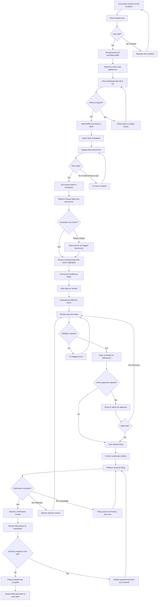

# Customer Journey To-Be: Automated Tax Filing SaaS — Accountant Persona

## Overview

This journey maps the projected experience of an accountant user within a B2B SaaS platform that automates client tax filing for small accounting firms. The accountant receives an account from the firm admin, uploads client documents, reviews system-extracted data on pre-filled tax forms, and submits filings to the tax authority.

---

## Phase 1: Accept Invitation and Onboard

**Happy path:**
1. Accountant receives an email invitation from the firm admin with a link to join the platform
2. Accountant clicks the link and lands on a registration page with firm name pre-filled
3. Accountant sets their password and completes their profile (name, role, contact info)
4. Accountant lands on a welcome screen with a quick guided tour of the dashboard

**Exceptions:**
- **Invitation link expired:** Page shows an expiration message and a button to request a new invitation from the firm admin
- **Accountant already has an account on another firm:** Platform detects the email and offers to link the new firm as an additional workspace

**Touchpoints:** Email, web app

---

## Phase 2: Navigate Dashboard and Select Client

**Happy path:**
1. Accountant logs into the platform and sees the dashboard showing a list of assigned clients and their filing statuses
2. Accountant uses search or filters (status, filing deadline, client name) to find the client they want to work on
3. Accountant selects a client to open the client workspace

**Exceptions:**
- **No clients assigned yet:** Dashboard shows an empty state explaining that the firm admin needs to assign clients, with a shortcut to notify the admin
- **Client has a past-due filing deadline:** Client card displays a visual alert so the accountant can prioritize it

---

## Phase 3: Upload Client Documents

**Happy path:**
1. Inside the client workspace, accountant clicks "Upload Documents"
2. Accountant drags and drops or selects files (W-2s, 1099s, receipts, prior-year returns) from their computer
3. Platform validates file types and sizes, shows upload progress, and confirms successful upload
4. Uploaded documents appear in the client's document list with file name, type, and upload date

**Exceptions:**
- **Unsupported file format:** Platform rejects the file and shows a message listing accepted formats (PDF, JPG, PNG, CSV)
- **File exceeds size limit:** Platform shows the maximum size and suggests compressing or splitting the document
- **Duplicate document uploaded:** Platform detects the duplicate and asks the accountant to confirm replacement or skip

**Touchpoints:** Web app

---

## Phase 4: Review Extracted Data

**Happy path:**
1. After upload, the platform automatically processes documents and extracts key data (income figures, deductions, taxpayer info)
2. Accountant receives a notification when extraction is complete and navigates to the "Extracted Data" tab
3. Accountant sees a structured summary of extracted fields, each linked back to the source document highlight
4. Accountant verifies each field, correcting any values the system flagged as low-confidence
5. Accountant marks the extracted data as "Verified"

**Exceptions:**
- **Extraction fails for a document:** Platform flags the document as "Needs Manual Entry" and provides a form for the accountant to input data by hand
- **Low-confidence extraction on critical fields:** Platform highlights those fields in yellow with a confidence score, requiring explicit accountant confirmation before proceeding
- **Missing required document:** Platform shows a checklist of expected document types and indicates which ones are missing, with an option to upload additional files

**Touchpoints:** Web app, push/email notification (extraction complete)

---

## Phase 5: Review Pre-Filled Tax Forms

**Happy path:**
1. Accountant clicks "Generate Tax Forms" and the platform populates the appropriate tax forms with verified extracted data
2. Accountant sees a form-by-form view with all fields pre-filled and editable
3. Accountant reviews each form, making corrections or additions where needed
4. Platform runs built-in validation rules (math checks, cross-form consistency, required fields) and shows a green "All checks passed" status
5. Accountant marks the filing as "Ready for Submission"

**Exceptions:**
- **Validation errors detected:** Platform lists specific errors (e.g., income totals do not match across forms) with links to the offending fields so the accountant can fix them
- **Tax form type not supported:** Platform notifies the accountant that a required form is not yet available and suggests manual filing for that form
- **Accountant wants a second opinion:** Accountant clicks "Request Review" to send the pre-filled forms to another accountant or the firm admin for a peer check

**Touchpoints:** Web app

---

## Phase 6: Submit to Tax Authority

**Happy path:**
1. Accountant clicks "Submit Filing" from the review screen
2. Platform shows a final confirmation summary (client name, filing type, tax year, forms included) and asks for explicit confirmation
3. Accountant confirms and the platform transmits the filing electronically to the tax authority
4. Platform displays a submission receipt with confirmation number, timestamp, and expected processing timeline
5. Filing status updates to "Submitted" on the client workspace and the dashboard

**Exceptions:**
- **Tax authority API is unavailable:** Platform shows an error message, saves the filing as "Pending Submission," and automatically retries; accountant receives a notification when submission succeeds or if manual intervention is needed
- **Tax authority rejects the filing:** Platform displays the rejection reason from the authority and links the accountant back to the relevant form fields to correct and resubmit
- **Firm requires admin approval before submission:** Platform routes the filing to the firm admin for approval; accountant sees status as "Awaiting Approval" and is notified when approved or returned with comments

**Touchpoints:** Web app, email/push notification (submission confirmation, rejection alert)

---

## Phase 7: Track Filing Status and Follow Up

**Happy path:**
1. After submission, the accountant monitors filing status on the client workspace (Submitted, Accepted, Processing, Complete)
2. Platform polls the tax authority for status updates and reflects changes automatically
3. When the tax authority accepts the filing, the accountant and client receive confirmation
4. Accountant archives the completed filing and moves to the next client

**Exceptions:**
- **Tax authority requests additional information:** Platform surfaces the request with details; accountant uploads supplemental documents and resubmits
- **Client disputes a filed amount:** Accountant opens the archived filing, reviews the forms, and initiates an amendment workflow if needed
- **Filing status stalls with no update:** Platform alerts the accountant after a configurable period of no status change, suggesting to contact the tax authority directly

**Touchpoints:** Web app, email/push notification (status updates)

---

## Journey Diagram

