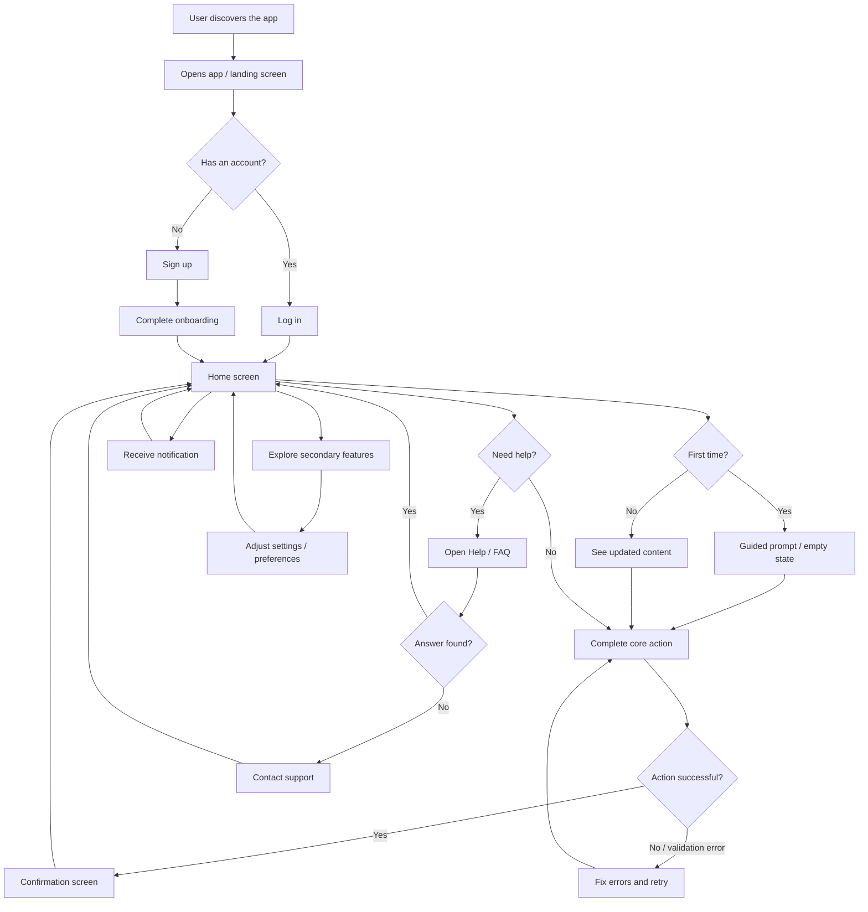

# Customer Journey To-Be: [Your App]

> **Note:** The input provided was "make me a journey map for my app." This is too vague
> to produce an accurate, actionable journey map. The sections below are based on
> **assumed generic phases** common to most consumer apps. To refine this into a useful
> design artifact, please provide:
>
> 1. **What the app does** -- a one-sentence description of the product or feature
>    (e.g., "A mobile app for booking home cleaning services").
> 2. **Who the primary user is** -- the target persona
>    (e.g., "Busy professionals who want on-demand cleaning").
> 3. **The main things a user would do, in order** -- the core user goals
>    (e.g., "Sign up, browse cleaners, book a session, pay, leave a review").
> 4. **Scope** -- the full journey or a specific part of it
>    (e.g., "Just the onboarding and first booking").
>
> Once those inputs are provided, this map will be regenerated with accurate phases,
> steps, and exception flows tailored to your product.

## Overview

This journey maps the generic experience of a new user discovering, signing up for,
using the core feature of, and returning to a consumer application. The primary user
is assumed to be a first-time user with no prior context about the app.

---

## Phase 1: Discovery and Sign-Up

**Happy path:**
1. User discovers the app through a link, ad, or app store search
2. User opens the app and sees a landing screen explaining the core value proposition
3. User taps "Get Started" and creates an account using email or social login
4. User completes a brief onboarding flow (e.g., name, preferences)
5. User lands on the main dashboard/home screen

**Exceptions:**
- **User already has an account:** User taps "Log In" instead, enters credentials, and lands on the home screen
- **Social login fails:** App falls back to email/password registration with a clear error message
- **User abandons onboarding midway:** App saves progress so the user can resume on next open

---

## Phase 2: First-Time Core Action

**Happy path:**
1. User sees a guided prompt or empty state directing them to the app's primary action
2. User follows the prompt and completes the core action (e.g., creates a project, makes a booking, adds an item)
3. App confirms the action was successful with a summary screen
4. User sees the result reflected on the home screen

**Exceptions:**
- **User does not understand what to do:** App shows a tooltip or walkthrough highlighting the primary action button
- **Core action requires additional input the user does not have yet:** App allows saving a draft and returning later
- **Validation error during the action:** App highlights the problematic field with an inline error message and keeps the rest of the input intact

---

## Phase 3: Exploring and Configuring

**Happy path:**
1. User explores secondary features visible from the home screen or navigation menu
2. User adjusts settings or preferences to personalize the experience
3. User discovers additional functionality that complements the core action

**Exceptions:**
- **Feature is behind a paywall:** App clearly communicates what is included in the free tier and what requires an upgrade, with a path to upgrade
- **User gets lost in navigation:** App provides a persistent bottom navigation bar or breadcrumb trail to return to the home screen

---

## Phase 4: Returning and Repeating

**Happy path:**
1. User receives a notification (push or email) that brings them back to the app
2. User opens the app and sees updated content or status changes since last visit
3. User repeats the core action or engages with new content
4. App reinforces the habit loop with progress indicators or streaks

**Exceptions:**
- **User has been inactive for a long time:** App sends a re-engagement email with a summary of what they missed and a single call-to-action to return
- **User's previous session data is outdated:** App shows a "What's New" prompt summarizing changes since their last visit

**Touchpoints:** App, push notification, email

---

## Phase 5: Getting Help or Resolving Issues

**Happy path:**
1. User taps a "Help" or "Support" option in the navigation menu
2. User browses an FAQ or types a question into a search bar
3. User finds the answer and returns to the app's main flow

**Exceptions:**
- **FAQ does not answer the question:** App offers a "Contact Support" option with chat, email, or form submission
- **User encounters a bug or crash:** App shows a graceful error screen with a "Report Issue" button and an option to retry

**Touchpoints:** App, email (support responses)

---

## Journey Diagram

---

> **Next step:** Provide a description of what your app does, who it is for, and the
> main actions a user takes. This map will be replaced with a precise, product-specific
> journey.
