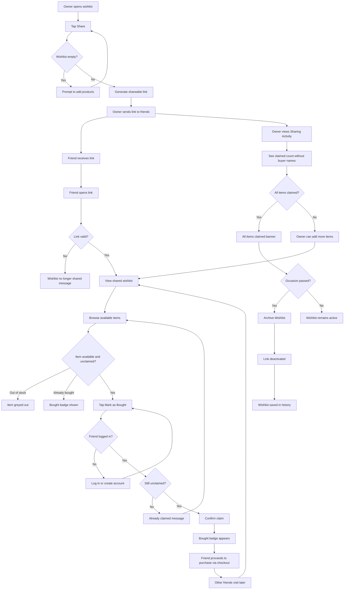

# Customer Journey To-Be: Wishlist Sharing & Gift Coordination

## Overview

This journey maps the experience of sharing a wishlist with friends and coordinating gift purchases so that no item is bought twice. There are two personas involved: the **Wishlist Owner** who creates and shares the list, and the **Friend** (gift-giver) who receives the shared link, browses the list, and marks items as bought.

---

## Phase 1: Share a Wishlist

**Happy path:**
1. Wishlist Owner navigates to one of their existing wishlists in the e-commerce app
2. Owner taps the "Share" button on the wishlist detail page
3. App generates a unique shareable link and displays it with copy-to-clipboard and direct-share options (messaging apps, email, social)
4. Owner copies or sends the link to one or more friends
5. App confirms the link has been copied or shared and shows the wishlist status as "Shared"

**Exceptions:**
- **Wishlist is empty:** App shows a prompt suggesting the owner add at least one product before sharing, with a shortcut to browse products
- **Owner wants to limit access:** Owner can toggle "Require login to view" before sharing; when enabled, only authenticated users can open the link
- **Owner wants to revoke access:** Owner taps "Manage sharing" and disables the link, which immediately makes it inaccessible to anyone who has it

**Touchpoints:** Web app, native share sheet (mobile), email, messaging apps

---

## Phase 2: Open the Shared Wishlist

**Happy path:**
1. Friend receives the shared link via message, email, or social media
2. Friend taps the link and the e-commerce app (or website) opens directly to the shared wishlist view
3. Friend sees the wishlist name, the owner's display name, and the list of products with images, names, and prices
4. Each product shows its availability status (available, low stock, out of stock) and whether it has already been marked as "bought" by someone else

**Exceptions:**
- **Link has been revoked by the owner:** App displays a message explaining that this wishlist is no longer shared
- **Friend does not have the app installed (mobile):** Link opens in the mobile browser with a web version of the shared wishlist and an optional prompt to install the app
- **Product has been removed from the store:** Item appears greyed out with a "No longer available" label; friend cannot mark it as bought

**Touchpoints:** Web app, mobile app, email, messaging apps

---

## Phase 3: Mark an Item as Bought

**Happy path:**
1. Friend browses the shared wishlist and selects a product they intend to buy
2. Friend taps the "Mark as Bought" button on that product
3. App asks the friend to confirm: "Mark this as bought? The owner won't see who bought it, but others will see it's been claimed."
4. Friend confirms, and the product immediately shows a "Bought" badge visible to all friends who view the wishlist
5. The product detail remains visible (so friends can see what was on the list) but the "Mark as Bought" button is replaced with a "Bought" indicator

**Exceptions:**
- **Item was already marked as bought by another friend (race condition):** App shows a message: "Someone already claimed this item. Choose another gift?" and returns the friend to the wishlist
- **Friend is not logged in:** App prompts the friend to log in or create an account before marking an item, so the claim can be attributed and managed; after authentication, the friend returns to the same product
- **Friend changes their mind:** Friend taps "Undo" on the "Bought" badge within a configurable grace period (e.g., 30 minutes) to release the item back to the available pool

**Touchpoints:** Web app, mobile app

---

## Phase 4: Coordinate Across Multiple Friends

**Happy path:**
1. As friends open the shared wishlist at different times, each sees a real-time view of which items are still available and which are already marked as bought
2. A friend who wants to buy a specific item sees it is still available, marks it as bought, and proceeds to purchase it through the normal e-commerce checkout flow
3. Another friend opens the same wishlist later and sees the updated status, avoiding duplicate purchases
4. Friends can see a summary count at the top of the wishlist: "5 of 12 items claimed"

**Exceptions:**
- **All items have been claimed:** Wishlist shows a banner: "Every item on this list has been claimed!" with no further action needed
- **Owner adds new items after sharing:** New items appear at the top of the shared view with a "New" badge; friends who previously visited see the updated list on their next visit

**Touchpoints:** Web app, mobile app

---

## Phase 5: Owner Reviews Sharing Activity

**Happy path:**
1. Owner opens their shared wishlist and sees a "Sharing Activity" section
2. The section shows how many items have been marked as bought, without revealing which friend bought which item (to preserve gift surprise)
3. Owner sees the total count: "7 of 12 items claimed"
4. Owner can still add or remove products from the wishlist; changes are reflected immediately for all friends

**Exceptions:**
- **Owner removes an item that was already marked as bought:** App warns the owner: "This item has already been claimed by someone. Remove it anyway?" If confirmed, the item is removed and the friend who claimed it is not notified (the owner assumes responsibility for the communication)
- **Owner wants to stop sharing entirely:** Owner taps "Stop Sharing" to revoke the link; all friends who visit the link afterward see a "Wishlist no longer shared" message
- **No items have been claimed yet:** Activity section shows "No items claimed yet" with a suggestion to remind friends about the wishlist

**Touchpoints:** Web app, mobile app

---

## Phase 6: Gift-Giving Complete

**Happy path:**
1. After the gift-giving occasion has passed, the owner can tap "Archive Wishlist" to move it out of the active list
2. The shared link stops working and shows a "This wishlist has been archived" message
3. Owner can still view the archived wishlist in their account history for reference
4. The wishlist's bought/claimed status is preserved in the archive as a record

**Exceptions:**
- **Owner wants to reuse the wishlist:** Owner taps "Duplicate as New Wishlist" to create a copy with all claimed statuses reset, ready for a new occasion
- **Owner does not archive:** The shared link remains active indefinitely; the wishlist stays in the owner's active list until manually archived or deleted

**Touchpoints:** Web app, mobile app

---

## Journey Diagram

