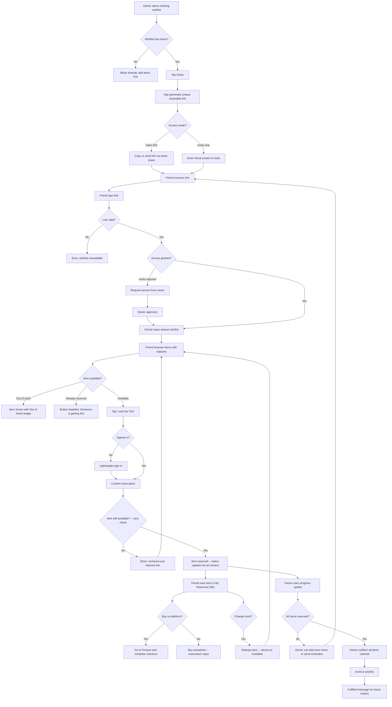

# Customer Journey To-Be: Wishlist Sharing & Gift Coordination

## Overview

This journey covers the sharing and gift-coordination flow for wishlists in an existing e-commerce application. It focuses exclusively on what happens after a user has already created a wishlist and added products to it. Two personas interact throughout: the **Wishlist Owner** (who shares and monitors) and the **Friend** (who receives a link, browses items, and coordinates purchases to avoid duplicates).

The scope intentionally excludes account creation, product browsing, catalog search, cart, checkout, and all other standard e-commerce flows.

---

## Phase 1: Share the Wishlist

**Actor:** Wishlist Owner

**Happy path:**
1. Owner opens an existing wishlist from "My Wishlists" and taps the "Share" button
2. App generates a unique, stable shareable URL containing a read-only access token
3. Owner chooses a distribution method: copy link to clipboard, send via OS share sheet (WhatsApp, iMessage, email, etc.), or share directly within the app by entering friend email addresses
4. App confirms the link has been copied or the invitation has been sent
5. The wishlist status changes from "Private" to "Shared" with a visible indicator

**Exceptions:**
- **Wishlist is empty:** App blocks sharing and shows a message: "Add at least one item before sharing"
- **Owner wants to share with specific people only:** Owner toggles "Invite Only" mode before generating the link; only friends who receive a direct invitation email can access the list, and the open link is disabled
- **Owner re-shares the same wishlist:** App reuses the same stable URL so all friends always see the latest version; no duplicate links are created

**Touchpoints:** Web app, mobile app, email, messaging apps

---

## Phase 2: Friend Receives and Opens the Shared Wishlist

**Actor:** Friend

**Happy path:**
1. Friend receives the wishlist link via email, messaging app, or social media
2. Friend taps the link and lands on a dedicated shared-wishlist view showing the wishlist name, the owner's display name, and the full list of products
3. Each product displays its image, name, current price, and a gift-coordination status: "Available," "Reserved by someone," or "Out of Stock"
4. Friend can browse the entire list without needing an account on the platform
5. A banner at the top explains the purpose: "Pick an item to buy as a gift. Mark it so others know it's taken."

**Exceptions:**
- **Link is invalid, expired, or revoked:** App shows a clear error page: "This wishlist is no longer available" with a link to the store homepage
- **Wishlist is set to Invite Only and friend was not invited:** App shows "This wishlist requires an invitation" with an option to request access from the owner
- **Owner has since deleted the wishlist:** App shows "This wishlist no longer exists" with no further action available
- **Product was removed by the owner since the link was sent:** The item simply does not appear on the shared view; the list reflects the current state

**Touchpoints:** Web app (mobile-optimized and desktop)

---

## Phase 3: Friend Marks an Item as "Bought" (Gift Reservation)

**Actor:** Friend

**Happy path:**
1. Friend finds an item marked "Available" and taps the "I'll Get This" button
2. App prompts a lightweight authentication step if the friend is not signed in: sign in with existing account, create account with email, or continue with a social login (Google, Apple)
3. App shows a confirmation dialog: "Reserve this item? Other friends will see it's taken, but the wishlist owner won't know who is buying it."
4. Friend confirms, and the item status immediately changes to "Reserved by someone" for all viewers
5. App shows a brief confirmation toast: "Reserved! You can undo this anytime from your reserved items."

**Exceptions:**
- **Race condition -- two friends tap simultaneously:** The server processes reservations sequentially; the first confirmation wins, and the second friend sees "Someone just reserved this item" and is returned to the list
- **All items are already reserved or out of stock:** Friend sees a message: "All items on this wishlist are spoken for! You can still browse the store for other gift ideas." with a link to the store homepage
- **Item goes out of stock after being reserved:** The reservation remains valid (the friend may have already purchased it elsewhere); the item shows "Reserved by someone (Out of Stock in store)" so other friends understand the situation

**Touchpoints:** Web app

---

## Phase 4: Friend Manages Their Reservations

**Actor:** Friend

**Happy path:**
1. Friend navigates to "My Reserved Gifts" from their account menu, which lists all items they have reserved across all shared wishlists
2. Each reserved item shows the wishlist name, product details, and two action buttons: "Go to Product" and "Release Item"
3. Friend taps "Go to Product" to navigate to the product detail page and complete the purchase through the standard e-commerce checkout
4. After purchasing, the reservation remains in place -- no additional action is needed from the friend

**Exceptions:**
- **Friend changes their mind:** Friend taps "Release Item," confirms the action, and the item returns to "Available" status on the shared wishlist for other friends to claim
- **Friend bought the gift from a different store:** The item stays reserved; the system does not require proof of purchase from the platform
- **Friend's order is cancelled or refunded:** Friend must manually release the item via "My Reserved Gifts" to make it available again; the system does not automatically detect cancellations

**Touchpoints:** Web app, mobile app

---

## Phase 5: Owner Monitors Gift Progress (Surprise-Safe View)

**Actor:** Wishlist Owner

**Happy path:**
1. Owner opens their shared wishlist and sees a progress summary bar (e.g., "3 of 5 items reserved")
2. Each item displays one of three statuses: "Available," "Someone is getting this," or "Out of Stock"
3. The owner cannot see who reserved which item -- buyer identity is intentionally hidden to preserve the gift surprise
4. Owner receives a push notification each time an item's status changes (reserved or released), without revealing the friend's identity

**Exceptions:**
- **Owner adds a new item to the wishlist after sharing:** The new item appears immediately for all friends with the link, with "Available" status
- **Owner removes an item that has been reserved:** App warns: "A friend has already reserved this as a gift. Removing it will notify them. Continue?" If confirmed, the friend who reserved it sees a notification: "The owner removed [item name] from their wishlist"
- **Owner wants to see who is participating:** Owner can see a count of unique visitors (e.g., "5 friends have viewed this wishlist") but not individual names or which items they reserved
- **Owner tries to mark items on their own wishlist:** The "I'll Get This" button is hidden from the owner's view to prevent self-reservation

**Touchpoints:** Web app, mobile app, push notifications

---

## Phase 6: Link Management and Access Control

**Actor:** Wishlist Owner

**Happy path:**
1. Owner opens wishlist settings and sees the current sharing status: active link, number of viewers, and number of reservations
2. Owner can copy the link again to share with additional friends
3. Owner can toggle "Invite Only" mode on or off at any time

**Exceptions:**
- **Owner wants to revoke all access:** Owner taps "Stop Sharing" which immediately invalidates the link; friends who visit the old URL see "This wishlist is no longer shared"; all existing reservations are preserved in friends' "My Reserved Gifts" but marked as "Wishlist closed"
- **Owner wants to generate a new link (invalidate old one):** Owner taps "Reset Link" which creates a new URL and invalidates the previous one; the owner must re-share the new link manually
- **Owner accidentally stops sharing:** Owner can tap "Resume Sharing" which reactivates the same link, restoring access for anyone who still has it

**Touchpoints:** Web app, mobile app

---

## Phase 7: Wishlist Completion and Archival

**Actor:** Wishlist Owner, Friend

**Happy path:**
1. When all items on the wishlist are reserved, the owner receives a notification: "Every item on [wishlist name] has been claimed by your friends!"
2. Owner can archive the wishlist, which moves it from the active list to an "Archived" section
3. Friends who visit the link of an archived wishlist see: "This wishlist has been fulfilled. Thank you!" along with a read-only view of the items
4. Archived wishlists remain accessible to the owner for reference but cannot be modified

**Exceptions:**
- **Not all items are reserved and the event date has passed:** Wishlist stays active indefinitely; the owner can archive it manually at any time regardless of reservation status
- **Owner wants to reuse the wishlist for another occasion:** Owner taps "Duplicate Wishlist" which creates a new copy with all the same products but resets all reservation statuses and generates a new sharing link
- **Friend visits an archived wishlist and wants to release their reservation:** Release is no longer available on archived wishlists; the reservation is locked for record-keeping purposes

**Touchpoints:** Web app, mobile app, push notification, email

---

## Journey Diagram

