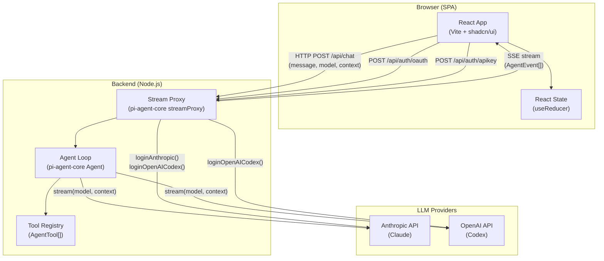
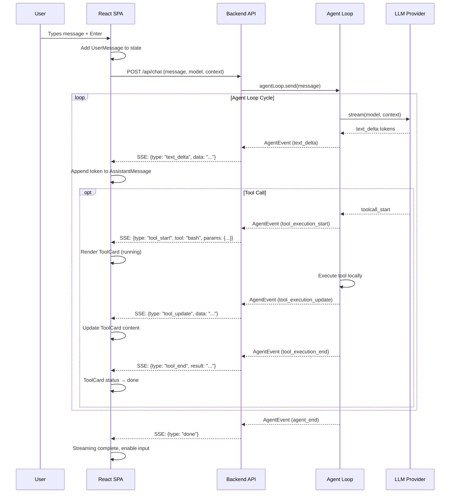
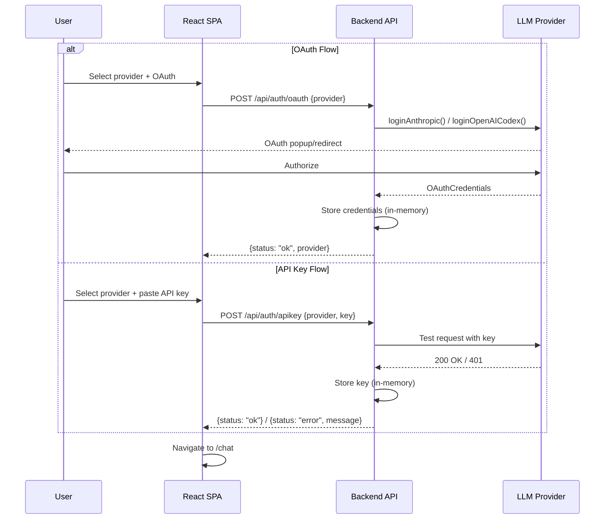
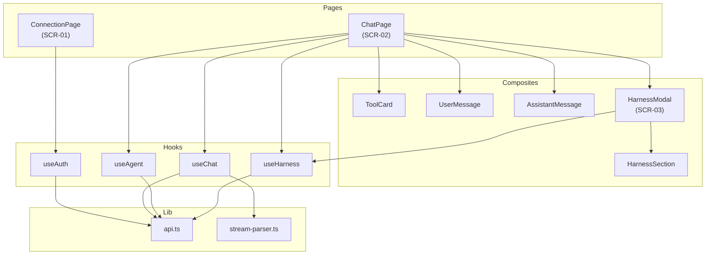

# Architecture: Pi AI Chat Web

> **Tipo:** POC
> **Pattern:** SPA + Backend Proxy
> **Data:** 2026-04-03

---

## 1. Requirements Summary

### Functional

| # | Requirement | Source |
|---|------------|--------|
| F1 | Autenticacao via OAuth ou API Key (Anthropic, OpenAI Codex) | BRIEF, JOURNEY Phase 1 |
| F2 | Chat interativo com streaming em tempo real | BRIEF, JOURNEY Phase 2 |
| F3 | Troca de agente (Claude Code / Codex) em runtime | BRIEF, JOURNEY Phase 3 |
| F4 | Troca de modelo por provider via `getModels()` | BRIEF, JOURNEY Phase 4 |
| F5 | Visualizacao diferenciada de tool calls (6+ tipos) | BRIEF, JOURNEY Phase 5 |
| F6 | Carregamento de harness (CLAUDE.md, AGENTS.md, skills, hooks) | BRIEF, JOURNEY Phase 6 |

### Non-Functional

| # | Requirement | Target |
|---|------------|--------|
| NF1 | Latencia do primeiro token | < 500ms |
| NF2 | Plataforma | Desktop browser only |
| NF3 | Persistencia | Nenhuma (in-memory) |
| NF4 | Usuarios simultaneos | 1 (uso pessoal) |
| NF5 | Seguranca | API keys nao devem ser expostas no frontend |
| NF6 | Destino do codigo | Pode servir de base para MVP |

### Constraints

- Stack fixa: pi-ai + pi-agent-core (o que estamos validando)
- Sem banco de dados
- Sem auth de usuario (apenas auth de provider LLM)
- Sem deploy em producao
- Prazo: 2 horas

---

## 2. High-Level Architecture



### Deployment View

```
┌─────────────────────────────────────────────────────┐
│                  Local Machine                       │
│                                                      │
│  ┌──────────────────┐    ┌────────────────────────┐  │
│  │   Vite Dev Server │    │  Node.js Backend      │  │
│  │   :5173           │    │  :3001                 │  │
│  │                    │    │                        │  │
│  │  React SPA        │───▶│  /api/auth/*           │  │
│  │  (static assets)  │    │  /api/chat             │  │
│  │                    │    │  /api/models           │  │
│  │                    │◀───│  SSE (streaming)       │  │
│  └──────────────────┘    └──────────┬─────────────┘  │
│                                      │                │
└──────────────────────────────────────┼────────────────┘
                                       │
                              ┌────────▼────────┐
                              │  LLM Provider   │
                              │  (Anthropic /   │
                              │   OpenAI)       │
                              └─────────────────┘
```

---

## 3. Architecture Pattern: SPA + Backend Proxy

O projeto segue o padrao **SPA com backend proxy**, onde:

- **Frontend (SPA)**: React app que renderiza a UI, gerencia estado local, e consome eventos de streaming
- **Backend (Proxy)**: Servidor Node.js fino que roteia chamadas LLM, gerencia credenciais OAuth, e executa o agent loop

Este padrao e necessario porque:
1. APIs LLM nao permitem chamadas diretamente do browser (CORS, API keys expostas)
2. O `streamProxy` do pi-agent-core foi desenhado exatamente para este cenario
3. O agent loop (tool execution) precisa rodar server-side (tools como bash, read/write executam no servidor)

---

## 4. Module Structure

```
pi-ai-poc/
├── src/
│   ├── client/                    # Frontend (React SPA)
│   │   ├── app.tsx                # Root component + router
│   │   ├── main.tsx               # Vite entry point
│   │   ├── components/
│   │   │   ├── ui/                # shadcn/ui primitives
│   │   │   │   ├── button.tsx
│   │   │   │   ├── input.tsx
│   │   │   │   ├── select.tsx
│   │   │   │   ├── card.tsx
│   │   │   │   ├── dialog.tsx
│   │   │   │   ├── badge.tsx
│   │   │   │   ├── alert.tsx
│   │   │   │   ├── separator.tsx
│   │   │   │   ├── tooltip.tsx
│   │   │   │   ├── scroll-area.tsx
│   │   │   │   └── textarea.tsx
│   │   │   ├── chat/              # Chat-specific composites
│   │   │   │   ├── chat-layout.tsx
│   │   │   │   ├── message-list.tsx
│   │   │   │   ├── user-message.tsx
│   │   │   │   ├── assistant-message.tsx
│   │   │   │   ├── streaming-cursor.tsx
│   │   │   │   ├── chat-input.tsx
│   │   │   │   └── empty-state.tsx
│   │   │   ├── tools/             # Tool card composites
│   │   │   │   ├── tool-card.tsx         # Router by variant
│   │   │   │   ├── bash-card.tsx
│   │   │   │   ├── file-card.tsx
│   │   │   │   ├── search-card.tsx
│   │   │   │   ├── agent-card.tsx
│   │   │   │   └── generic-card.tsx
│   │   │   ├── header/
│   │   │   │   ├── app-header.tsx
│   │   │   │   ├── agent-selector.tsx
│   │   │   │   └── model-selector.tsx
│   │   │   ├── connection/
│   │   │   │   ├── connection-page.tsx
│   │   │   │   └── segmented-control.tsx
│   │   │   └── harness/
│   │   │       ├── harness-modal.tsx
│   │   │       ├── harness-section.tsx
│   │   │       └── status-indicator.tsx
│   │   ├── hooks/                 # React hooks
│   │   │   ├── use-chat.ts        # Chat state + streaming consumer
│   │   │   ├── use-auth.ts        # Auth state + provider connection
│   │   │   ├── use-agent.ts       # Agent/model selection
│   │   │   └── use-harness.ts     # Harness loading state
│   │   ├── lib/                   # Utilities
│   │   │   ├── api.ts             # HTTP client for backend
│   │   │   ├── stream-parser.ts   # SSE event parser
│   │   │   ├── types.ts           # Shared types
│   │   │   └── cn.ts              # Tailwind class merge
│   │   └── styles/
│   │       └── globals.css        # Tailwind + custom tokens
│   │
│   └── server/                    # Backend (Node.js)
│       ├── index.ts               # Server entry point (Hono)
│       ├── routes/
│       │   ├── auth.ts            # /api/auth/* — OAuth + API Key
│       │   ├── chat.ts            # /api/chat — stream proxy + agent loop
│       │   └── models.ts          # /api/models — model registry
│       ├── agent/
│       │   ├── setup.ts           # Agent creation + tool registration
│       │   ├── tools.ts           # Tool definitions (bash, read, write, etc.)
│       │   └── harness.ts         # Harness file loading + system prompt
│       └── lib/
│           ├── credentials.ts     # OAuth/API Key storage (in-memory)
│           └── stream-adapter.ts  # AgentEvent → SSE adapter
│
├── index.html                     # Vite HTML entry
├── vite.config.ts                 # Vite config (proxy to backend)
├── tailwind.config.ts             # Tailwind + design token integration
├── tsconfig.json
├── package.json
└── components.json                # shadcn/ui config
```

### Module Responsibilities

| Module | Responsibility | Key Dependencies |
|--------|---------------|------------------|
| `client/components/ui/` | shadcn/ui primitives (CMP-01 to CMP-18) | Radix UI, Tailwind |
| `client/components/chat/` | Chat message rendering (CMP-19 to CMP-22) | ui/, hooks/ |
| `client/components/tools/` | Tool card variants (CMP-19) | ui/ |
| `client/components/header/` | App header + selectors | ui/, hooks/ |
| `client/components/connection/` | SCR-01 connection page | ui/, hooks/ |
| `client/components/harness/` | SCR-03 harness modal (CMP-23) | ui/, hooks/ |
| `client/hooks/` | State management via React hooks | lib/api |
| `client/lib/` | HTTP client, SSE parser, types | - |
| `server/routes/` | API endpoints | agent/ |
| `server/agent/` | Agent loop, tools, harness | pi-ai, pi-agent-core |
| `server/lib/` | Credentials, stream adapter | pi-ai |

---

## 5. Data Flow: Chat with Streaming



---

## 6. Data Flow: Authentication



---

## 7. State Management

React state via `useReducer` + Context, sem biblioteca externa. Justificado pela simplicidade do POC (1 usuario, sem persistencia, 3 telas).

### State Shape

```typescript
interface AppState {
  // Auth
  auth: {
    status: 'disconnected' | 'connecting' | 'connected' | 'error';
    provider: 'anthropic' | 'openai' | null;
    error: string | null;
  };

  // Agent/Model
  agent: {
    current: 'claude-code' | 'codex';
    model: string | null;
    availableModels: Array<{ id: string; name: string }>;
  };

  // Chat
  chat: {
    messages: Message[];
    streaming: boolean;
    error: string | null;
  };

  // Harness
  harness: {
    claudeMd: HarnessFile | null;
    agentsMd: HarnessFile | null;
    skillsDir: HarnessFile | null;
    hooksDir: HarnessFile | null;
    applied: boolean;
  };
}

type Message =
  | { role: 'user'; content: string }
  | { role: 'assistant'; content: string; streaming: boolean }
  | { role: 'tool'; toolType: ToolCardVariant; title: string;
      status: ToolStatus; content: string };

type ToolCardVariant = 'bash' | 'file' | 'search' | 'agent'
                     | 'toolsearch' | 'generic';
type ToolStatus = 'running' | 'done' | 'error';

interface HarnessFile {
  path: string;
  size: number;
  detail?: string; // "3 agents", "5 skills"
  status: 'loaded' | 'error';
  error?: string;
}
```

### State Distribution

```
┌─────────────────────────────────────────────────┐
│ AppProvider (Context + useReducer)               │
│                                                  │
│  ┌────────────────┐  ┌────────────────────────┐  │
│  │ ConnectionPage │  │ ChatPage               │  │
│  │                │  │                        │  │
│  │ useAuth()      │  │ useChat()              │  │
│  │ - provider     │  │ - messages[]           │  │
│  │ - method       │  │ - streaming            │  │
│  │ - connect()    │  │ - sendMessage()        │  │
│  │                │  │                        │  │
│  └────────────────┘  │ useAgent()             │  │
│                      │ - current agent        │  │
│                      │ - current model        │  │
│                      │ - switchAgent()        │  │
│                      │ - switchModel()        │  │
│                      │                        │  │
│                      │ useHarness()           │  │
│                      │ - files[]              │  │
│                      │ - applyHarness()       │  │
│                      └────────────────────────┘  │
└─────────────────────────────────────────────────┘
```

---

## 8. API Surface

### Backend Endpoints

| Method | Path | Request | Response | Description |
|--------|------|---------|----------|-------------|
| POST | `/api/auth/oauth` | `{provider}` | `{status, provider}` | Initiate OAuth flow |
| POST | `/api/auth/apikey` | `{provider, key}` | `{status, error?}` | Validate + store API key |
| GET | `/api/models` | `?provider=...` | `{models: [{id, name}]}` | List available models |
| POST | `/api/chat` | `{message, model, context}` | SSE stream | Send message, receive streaming |
| POST | `/api/harness/load` | `{files: [{path, type}]}` | `{results: [{status, detail}]}` | Load harness files |
| POST | `/api/harness/apply` | - | `{status}` | Apply loaded harness to agent |

### SSE Event Types (streaming response)

```typescript
// POST /api/chat returns SSE stream with these event types:

type SSEEvent =
  | { type: 'text_delta'; data: string }
  | { type: 'tool_start'; tool: string; id: string;
      params: Record<string, unknown> }
  | { type: 'tool_update'; id: string; data: string }
  | { type: 'tool_end'; id: string; result: string;
      status: 'done' | 'error' }
  | { type: 'thinking_delta'; data: string }
  | { type: 'error'; message: string }
  | { type: 'done' }
```

---

## 9. Technology Stack

| Layer | Technology | Rationale |
|-------|-----------|-----------|
| Frontend framework | React 19 | Ecossistema maduro, shadcn/ui requer React |
| Build tool | Vite 6 | HMR rapido, TypeScript nativo, proxy de dev |
| Styling | Tailwind CSS 4 | Utility-first, integra com design tokens e shadcn/ui |
| Component library | shadcn/ui | Headless + Tailwind, 14/23 componentes mapeiam |
| Backend framework | Hono | Leve, TypeScript-first, streaming nativo |
| LLM API | @mariozechner/pi-ai | Obrigatorio — e o que estamos validando |
| Agent framework | @mariozechner/pi-agent-core | Obrigatorio — agent loop e tools |
| Routing (frontend) | React Router 7 | SPA routing simples (`/` e `/chat`) |
| Markdown | react-markdown + remark-gfm | Respostas do assistant em Markdown |
| Syntax highlighting | Shiki | Code blocks em tool cards e respostas |
| Icons | Lucide React | Icone set do shadcn/ui |

---

## 10. Risks and Mitigations

| Risk | Impact | Prob. | Mitigation |
|------|--------|-------|------------|
| pi-ai streaming API incompativel com SSE adapter | Alto | Medio | Testar streaming isoladamente; `streamProxy` existe para isso |
| OAuth flow complexo demais para POC de 2h | Alto | Alto | Comecar com API Key; OAuth como stretch goal |
| Tool execution no server expoe riscos | Medio | Baixo | Local-only, single-user; nao expor na rede |
| Agent loop nao suporta troca de modelo mid-session | Medio | Medio | Nova instancia de Agent a cada troca; contexto via history |
| Harness files muito grandes para context window | Baixo | Baixo | Alertar no frontend; limitar tamanho no backend |

---

## 11. Implementation Priority

```
Phase 1: Foundation (30 min)
├── Project setup (Vite + React + Tailwind + shadcn/ui)
├── Backend setup (Hono + endpoints skeleton)
├── Vite proxy config (frontend → backend)
└── Basic types + API client

Phase 2: Auth + Connection (20 min)
├── Backend: /api/auth/apikey endpoint
├── Backend: credentials storage (in-memory)
├── Frontend: SCR-01 Connection page
└── Frontend: useAuth hook + API key flow

Phase 3: Chat + Streaming (30 min)
├── Backend: /api/chat endpoint + Agent setup
├── Backend: AgentEvent → SSE adapter
├── Frontend: SSE parser + useChat hook
├── Frontend: SCR-02 Chat layout + messages
└── Frontend: Streaming cursor

Phase 4: Tool Cards (20 min)
├── Frontend: ToolCard component (6 variants)
├── Frontend: Expand/collapse + StatusBadge
└── SSE tool events integration

Phase 5: Agent/Model Switching (10 min)
├── Backend: /api/models endpoint
├── Frontend: Agent selector + Model selector
└── Frontend: useAgent hook

Phase 6: Harness (10 min)
├── Backend: /api/harness/* endpoints
├── Frontend: SCR-03 Harness modal
└── Frontend: useHarness hook
```

---

## 12. Component Dependency Graph



---

## See Also

- **ADRs:** `.harn/docs/adr/`
- **BRIEF:** `.harn/docs/BRIEF.md`
- **JOURNEY:** `.harn/docs/JOURNEY.md`
- **UI Spec:** `.harn/design/UI-SPEC.md`
- **Components:** `.harn/design/COMPONENTS.md`
- **Design Tokens:** `.harn/design/design-tokens.json`
