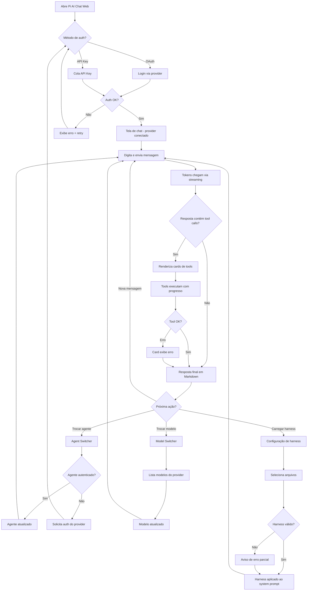

# Customer Journey To-Be: Pi AI Chat Web

## Overview

Esta jornada mapeia a experiência de um desenvolvedor (o próprio autor) usando o Pi AI Chat Web para interagir com LLMs via streaming em tempo real, trocar agentes e modelos, carregar harnesses e visualizar tool calls — validando se a stack pi-ai + pi-agent-core sustenta essa experiência.

---

## Phase 1: Autenticação no Provider

**Happy path:**
1. Usuário abre o Pi AI Chat Web no browser
2. Tela inicial exibe opções de conexão: OAuth (Anthropic / OpenAI Codex) ou API Key
3. Usuário seleciona o provider desejado (ex.: Anthropic) e o método de auth (OAuth ou API Key)
4. Para OAuth: fluxo de login do provider abre em popup/redirect; usuário autoriza e retorna ao app autenticado
5. Para API Key: usuário cola a chave no campo; app valida a chave e confirma conexão
6. App exibe a tela de chat com o provider conectado e o modelo padrão selecionado

**Exceptions:**
- **OAuth falha ou é cancelado:** App exibe mensagem de erro com opção de tentar novamente ou usar API Key como alternativa
- **API Key inválida:** App exibe feedback inline indicando que a chave é inválida e mantém o campo para correção
- **Provider indisponível:** App exibe status do provider e sugere tentar o outro provider disponível

**Touchpoints:** Web app, popup OAuth do provider

---

## Phase 2: Primeira Interação — Chat com Streaming

**Happy path:**
1. Usuário vê a área de chat vazia com um campo de input na parte inferior
2. Usuário digita uma mensagem e envia (Enter ou botão)
3. Tokens começam a aparecer em tempo real na área de chat (streaming via `stream()`)
4. Resposta completa é exibida formatada em Markdown quando o stream termina
5. Usuário pode enviar mensagens adicionais, mantendo o contexto da conversa

**Exceptions:**
- **Erro de conexão durante streaming:** App exibe mensagem de erro inline abaixo da última mensagem do usuário, com botão "Tentar novamente"
- **Latência alta (>500ms para primeiro token):** Indicador de "pensando..." é exibido enquanto aguarda o primeiro token
- **Resposta vazia do LLM:** App exibe aviso de que o modelo não gerou resposta e sugere reformular a pergunta

---

## Phase 3: Troca de Agente

**Happy path:**
1. Usuário localiza o agent switcher na interface (header ou sidebar)
2. Switcher exibe os agentes disponíveis: Claude Code e Codex
3. Usuário seleciona o outro agente (ex.: de Claude Code para Codex)
4. App atualiza o provider/modelo e exibe indicador visual do agente ativo
5. Contexto da conversa é mantido; próxima mensagem usa o novo agente

**Exceptions:**
- **Agente selecionado não está autenticado:** App solicita autenticação no provider correspondente antes de completar a troca
- **Troca falha por erro de rede:** App mantém o agente anterior ativo e exibe mensagem de erro com opção de retry

---

## Phase 4: Troca de Modelo

**Happy path:**
1. Usuário localiza o model switcher na interface (próximo ao agent switcher)
2. Switcher lista os modelos disponíveis para o agente/provider ativo (via `getModels()`)
3. Usuário seleciona um modelo diferente
4. App confirma a troca com indicador visual do modelo ativo
5. Próxima mensagem usa o novo modelo; conversa continua normalmente

**Exceptions:**
- **Nenhum modelo disponível para o provider:** App exibe mensagem indicando que o provider não retornou modelos disponíveis
- **Modelo selecionado fica indisponível após troca:** App faz fallback para o modelo padrão do provider e notifica o usuário

---

## Phase 5: Visualização de Tool Calls

**Happy path:**
1. Usuário envia uma mensagem que aciona tool calls pelo agente (ex.: "leia o arquivo X" ou "busque por Y")
2. App exibe um card de tool call em tempo real, com tipo identificado visualmente:
   - `bash` → bloco de terminal com comando e output
   - `read`/`write` → bloco de arquivo com path destacado
   - `glob`/`grep` → resultado de busca formatado
   - `subagent`/`skill` → card expandível com status (running → done)
   - `toolsearch` → lista de ferramentas encontradas
   - Demais tools → card genérico com nome, parâmetros e resultado
3. Cada tool call exibe progresso via eventos (`tool_execution_start` → `update` → `end`)
4. Após conclusão das tools, resposta final do agente aparece em streaming abaixo dos cards
5. Usuário pode expandir/colapsar cards de tool para ver detalhes ou economizar espaço

**Exceptions:**
- **Tool call falha:** Card exibe status de erro com a mensagem retornada; agente pode tentar abordagem alternativa
- **Tool call demora muito:** Indicador de progresso (spinner) é exibido no card; usuário pode continuar lendo tools anteriores
- **Tipo de tool desconhecido:** App renderiza o card genérico com nome e parâmetros JSON formatados

---

## Phase 6: Carregamento de Harness

**Happy path:**
1. Usuário acessa a configuração de harness (botão ou menu na interface)
2. App exibe opções para carregar harness: CLAUDE.md, AGENTS.md, skills, hooks
3. Usuário seleciona/aponta os arquivos de harness desejados
4. App carrega o harness e aplica ao system prompt do agente
5. Indicador visual confirma que o harness está ativo
6. Próxima interação com o LLM reflete o comportamento definido pelo harness

**Exceptions:**
- **Arquivo de harness não encontrado:** App exibe erro com o path esperado e permite selecionar manualmente
- **Harness com formato inválido:** App exibe aviso de parsing e carrega o que for possível, indicando o que foi ignorado
- **Harness muito grande para o context window:** App avisa sobre o tamanho e sugere reduzir o harness ou usar um modelo com context maior

---

## Journey Diagram

